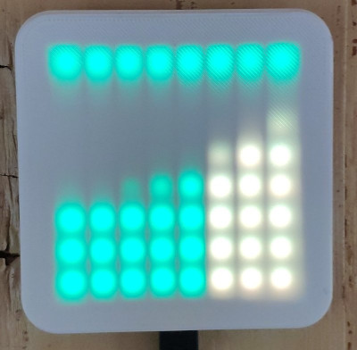

# Stromkosten-Display

Zeigt auf einer 8x8-Matrix aus WS2812-LEDs die Strompreise der
nächsten Stunden und den Status des Stromnetzes an. 

Primär interessant für Haushalte mit dynamischen Stromtarifen, die
Idee ist, die Preise im Blick zu haben, bevor man Großverbraucher
einschaltet.

Die Preise kommen über die
[aWATTar-API](https://www.awattar.at/services/api/), der Status von
[APG](https://www.apg.at/powermonitor/#c3883). Österreichische Daten
also.

## Hardware

* Ein ESP32, das Gehäuse ist für [diesen](https://www.az-delivery.de/products/esp32-dev-kit-c-unverlotet?variant=32437204549728)
* eine 8x8-Matrix aus WS2812-RGB-LEDs, wie [diese](https://www.az-delivery.de/products/u-64-led-panel?variant=40362432466)
* Ein 3D-gedrucktes Gehäuse, siehe Directory [CAD](./CAD/)
  
### Aufbau

5V und GND der LED-Matrix verbinden, GPIO16 vom ESP (`LED_PIN` im Code) mit
dem Datenpin der Matrix, fertig.

## Installation

Software-Installation: basiert auf
[PlatformIO](https://platformio.org/).

1) `include/config.h.dist` auf `include/config.h` kopieren und
editieren (WiFi-Daten, Schwellwerte für die Display-Farben)

2) `platformio.ini` ggf anpassen in sachen Upload

3) `pio run -t upload`

## Security-Warnung

Die APIs sind über HTTPS erreichbar. TL;DR: *die
Zertifikatsverifikation ist im Code ausgeschaltet.*

Da die HTTPS-Libraries für ESP32 nur ein einziges Root-Cert
unterstützen, besteht bei korrekter Verwendung das Problem, daß man
bei Änderung einer der CAs der API-Server dies erst mitbekommt, wenn
es schon geschehen ist, dann das korrekte Cert finden und in den Code
integrieren muß (oder mit noch mehr Programmieraufwand das im
Filesystem speichern und einen Mechanismus zum Updaten ohne
Recompilieren vorsehen muß). 

Das war mir zu aufwendig und widerspricht der Idee "Display, das
einfach an der Wand hängt und funktioniert."
